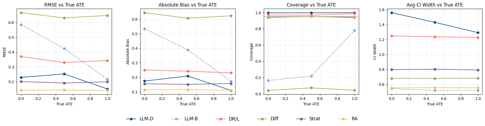
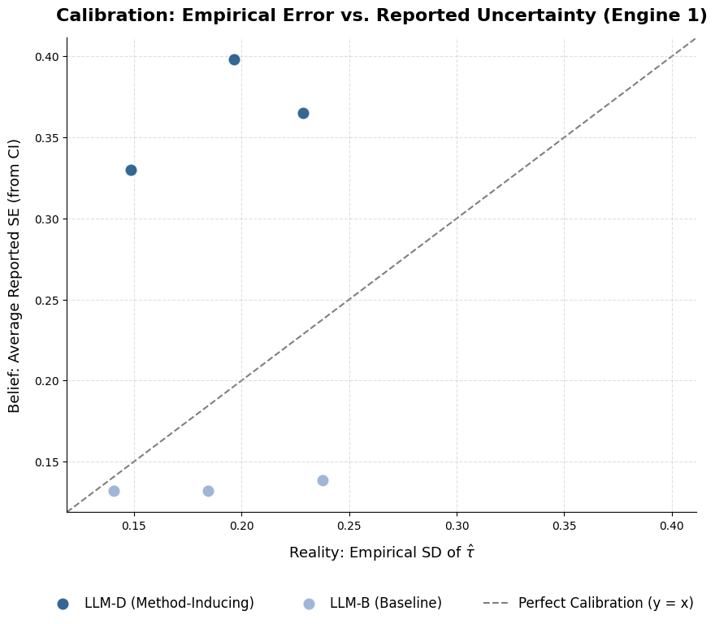
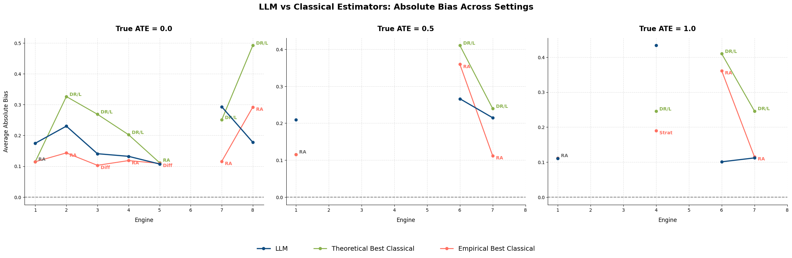
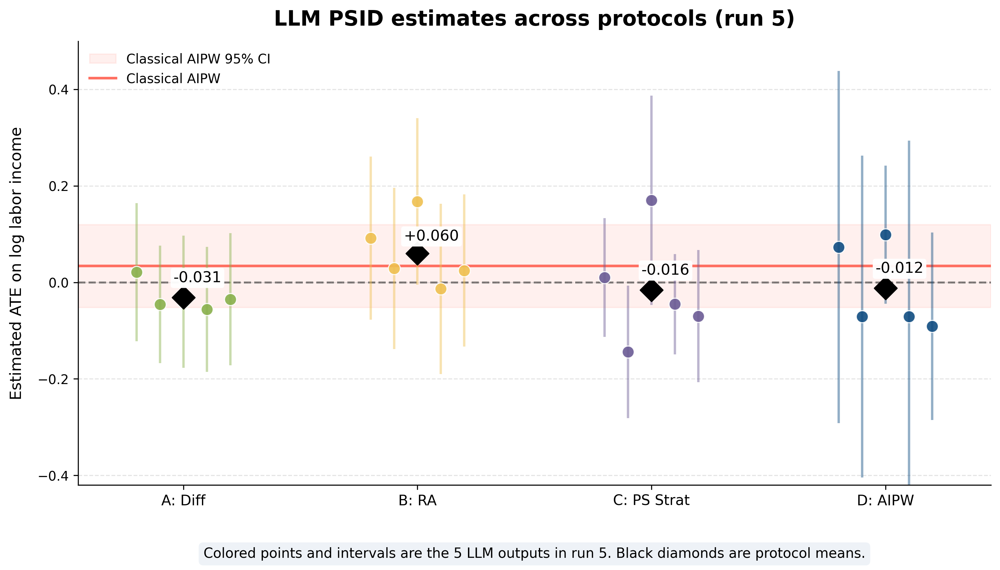

# Can LLMs Do Causal Inference?

Evaluating large language models as protocol-conditioned causal estimators using in-context learning, simulation benchmarks, classical causal methods, and a real-world PSID application.

## Overview

This project investigates whether a general-purpose pretrained large language model (LLM), without fine-tuning, can estimate the Average Treatment Effect (ATE) from observational data.

Rather than asking the LLM to infer causality directly from raw data, we design **method-inducing in-context learning (ICL) protocols** that provide estimator-specific summaries and instructions.

The framework combines:

- 8 simulation engines with known ground-truth ATEs
- 4 method-inducing ICL protocols
- Classical causal inference benchmarks
- Bias, RMSE, coverage, and uncertainty calibration
- A real-world Panel Study of Income Dynamics (PSID) case study

## Research Questions

1. Can ICL-prompted LLMs accurately estimate ATE?
2. How robust are LLM estimates under nonlinear confounding, heterogeneous treatment effects, weak overlap, missingness, and noisy data?
3. How well calibrated are LLM-reported confidence intervals?
4. How do LLM estimates compare with classical causal estimators?
5. Do the same protocol designs produce reasonable conclusions on real observational data?

## Methodology

### Simulation Benchmark

Eight simulation engines are used to stress-test different causal challenges:

| Engine | Main Challenge |
|---|---|
| 1 | Linear confounding with constant treatment effect |
| 2 | Nonlinear outcome model |
| 3 | Heterogeneous treatment effects and interactions |
| 4 | High-dimensional sparse confounding |
| 5 | Weak overlap / near-positivity violations |
| 6 | Nonlinear treatment assignment and confounding |
| 7 | Missing outcomes under MCAR / MAR |
| 8 | Measurement error and heavy-tailed noise |

Each simulated setting has a known ground-truth ATE, allowing direct evaluation of estimation error and confidence interval coverage.

### Method-Inducing ICL Protocols

The LLM is evaluated under structured protocols designed to induce specific causal estimators:

| Protocol | Target Method | Input Representation |
|---|---|---|
| A | Difference-in-means | Treated/control summary statistics |
| B1 | Regression adjustment | Compact microdata |
| B2 | Regression adjustment | Compressed regression output |
| C | Propensity-score stratification | Propensity-score bin summaries |
| D | AIPW / Doubly robust | Precomputed nuisance quantities |

The goal is to evaluate the LLM as a **constrained estimator interface**, rather than as an unrestricted causal-reasoning system.

### Classical Benchmarks

LLM-based estimates are compared with classical methods including:

- Difference-in-means
- Regression adjustment
- Propensity-score stratification
- Inverse Probability Weighting (IPW)
- Augmented IPW / Doubly Robust estimation

## Evaluation Metrics

Performance is evaluated using:

- Bias
- Absolute bias
- Root Mean Squared Error (RMSE)
- Empirical 95% confidence interval coverage
- Average confidence interval width
- Reported vs empirical uncertainty calibration
- Stability across simulation settings

## Key Results

### Structured ICL improves over raw-data prompting



In the simplest linear-confounding setting, the method-inducing Protocol D substantially improves RMSE and absolute bias relative to raw-data prompting while maintaining strong empirical coverage.

### Uncertainty calibration



The raw-data baseline tends to under-report uncertainty, while Protocol D is more conservative and better aligned with empirical variation.

### LLM vs. classical estimators across simulation settings



Across the simulation benchmark, the LLM performs competitively in several low-effect settings. However, larger true treatment effects often produce systematic underestimation.

Engine 6 is a notable exception: under nonlinear treatment assignment and nonlinear confounding, the structured LLM protocol achieves lower bias and stronger empirical coverage than the classical benchmark used in the study.

### Main Findings

- Method-inducing ICL substantially improves estimation relative to raw-data prompting.
- In low-effect settings, structured LLM protocols can achieve accuracy comparable to classical estimators.
- Larger true treatment effects reveal a tendency toward negative bias and shrinkage toward zero.
- LLM confidence intervals are generally wider than classical intervals, leading to conservative uncertainty quantification and frequent over-coverage.
- Structured prompting appears particularly useful in some difficult nonlinear settings.

The complete simulation summary is available at:

`results/llm_evaluation_protocol_results.xlsx`

## PSID Real-World Case Study

The framework is also applied to the **Panel Study of Income Dynamics (PSID)**.

The empirical question is whether participation in job training, vocational training, or related certification in **2013** is associated with long-run labor income measured in the **2023 PSID wave**.

The analysis uses:

- Pre-treatment covariates measured mainly in **2011**
- Treatment measured in **2013**
- Reference Person labor income for calendar year **2022**, reported in the **2023 wave**

The final cleaned sample contains **6,096 observations**, including **4,240 treated** and **1,856 control** units.

### Classical Estimates

| Estimator | ATE | SE | 95% CI |
|---|---:|---:|---:|
| Difference-in-means | -0.0047 | 0.0302 | [-0.0640, 0.0545] |
| OLS adjustment | 0.0159 | 0.0370 | [-0.0566, 0.0883] |
| PS stratification | 0.0390 | 0.0482 | [-0.0556, 0.1336] |
| AIPW / Doubly robust | 0.0339 | 0.0438 | [-0.0520, 0.1197] |

All classical 95% confidence intervals include zero, so the analysis does not provide statistically significant evidence of a nonzero long-run treatment effect under the study specification.

### LLM Protocol Results



Repeated LLM runs also produce protocol-level mean estimates close to zero:

| Protocol | Mean ATE | SD ATE | Mean CI Width |
|---|---:|---:|---:|
| A: Difference-in-means | -0.031 | 0.030 | 0.268 |
| B: Regression adjustment | 0.060 | 0.071 | 0.337 |
| C: PS stratification | -0.016 | 0.118 | 0.287 |
| D: AIPW | -0.012 | 0.090 | 0.560 |

Protocol D produces the widest intervals and therefore the most conservative uncertainty reporting among the four LLM protocols.

Overall, the LLM protocol outputs remain close to zero and are broadly consistent with the classical analysis, while still showing noticeable run-to-run variability.

> Individual-level PSID microdata are not included in this repository. See `data/README.md` for data description and reconstruction notes.

## Repository Structure

```text
.
├── notebooks/
├── src/
├── data/
│   ├── simulated/
│   └── README.md
├── results/
│   ├── figures/
│   └── llm_evaluation_protocol_results.xlsx
├── report/
│   ├── final_report.pdf
│   └── research_poster.pdf
└── README.md
```

## Technologies

- Python
- NumPy
- Pandas
- Scikit-learn
- Statsmodels
- Large Language Models
- Causal Inference
- Statistical Simulation
- In-Context Learning

## Report and Poster

- [Final Report](report/final_report.pdf)
- [Research Poster](report/research_poster.pdf)
